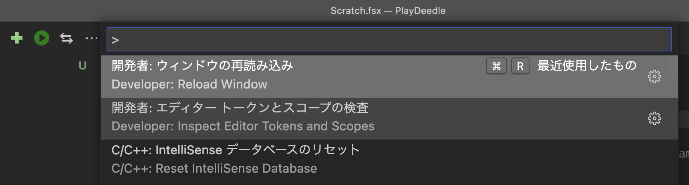

<style>
   .column{
        padding: 0.5em 1em;
        margin: 2em 0;
        color: #5d627b;
        background: white;
        border-top: solid 5px #5d627b;
        box-shadow: 0 3px 5px rgba(0, 0, 0, 0.22);
    }
    .post-content h1 {
       font-size: 34px;
    }
</style>

F# での基本的な作業の進め方に慣れつつ、あとで使う事になる準備として、
ライブラリをつついてみたいと思います。

## セットアップ

[Install F# with Visual Studio Code](https://docs.microsoft.com/en-us/dotnet/fsharp/get-started/install-fsharp#install-f-with-visual-studio-code)に従って.NET、VSCode、Ionideのインストールを行ってください。

## Deedleをつついてみよう

Deedleをつついてみましょう。

### fsharp-lesssonでのフォルダとブランチのルール

初回なので、少しfsharp-lesson全般の話をここでします。

まず作業は、fsharp-lessonのレポジトリ、[https://github.com/karino2/fsharp-lesson](https://github.com/karino2/fsharp-lesson)を各自がgithub上でforkして、それをローカルにcloneしたフォルダの上で作業する事にします。

ソースコードはsourcesの下のサブディレクトリに置く事にします。
第一回だったら、`sources/play_library/` というディレクトリがあると思うので、この下にそれぞれディレクトリをほって作業します。

また、少し通常のブランチの使い方と違いますが、添削の都合で各作業はブランチを切る事にします。
第一回のブランチ名は全て `play_library/` を前につけて、あとは数女の通し番号とどこかを表す名前を適当につけます。

例えばDeedleをいじってみるというこのブランチは`play_library/1_playdeedle` としましょう。
次のArguは`play_library/2_helloargu` とします。（2のラベル名はあとで変えるかも）

### PlayDeedleのブランチとプロジェクトの作成

それではまずはブランチとプロジェクトを作成してみます。
Deedleをいじってみるのはfsx上で行うのでプロジェクト無しでも良いのですが、
今後の開発の練習という事でPlayDeedleというプロジェクトを作る事にします。

まずは上記で説明した通り、`play_library/1_playdeedle`というブランチを切り、以後このブランチで作業します。

次にプロジェクトを作成します。場所は`sources/play_library/`の下に`PlayDeedle`というディレクトリが作られるようにプロジェクトを作ります。
以下のように実行しましょう。

```
$ cd sources/play_library
$ dotnet new console -lang "F#" -o PlayDeedle
```

この時にPlayDeedleというディレクトリは勝手に掘られるので、そのディレクトリは掘らないのがコツです。

プロジェクトの作り方の詳細については以下のドキュメントを見ましょう。

[Get Started with F# in Visual Studio Code - Microsoft Docs](https://docs.microsoft.com/en-us/dotnet/fsharp/get-started/get-started-vscode)

### fsxでDeedleをつついてみる

プロジェクトを作ったら、最初にするのは、私の場合はScratch.fsxというファイルを作ってVSCodeでこのプロジェクトを開く事です。
fsharp-lessonでもそうしてみましょう。

```
$ cd PlayDeedle
$ touch Scratch.fsx
$ code .
```

これでVSCodeが開くはずです。

Scratch.fsxはとりあえず実験用の書き捨てのコードを置く場所にしています。

VSCode上でScratch.fsxを開いて、以下のように書いてみましょう。

```
#r "nuget:Deedle"

open Deedle
```

そしてそれぞれの行の終わりで Alt+Enterを押します（その行を実行というショートカットです）

この時、最初の実行ではDeedleという所が破線のままでエラーっぽく表示されたままになっているかもしれません。
これはfsxではちょくちょくある事なので、実行したあとに「Windowの再読み込み」というのをやります。

せっかくなのでもし破線が出てない人も、ここでWindowを再読み込みしてみましょう。

Windowの再読み込みは、「Cmd+Shift+P」を押してから、「Reload」と入力するとそれっぽい候補が出ると思うのでそれを選んでEnterを押して下さい。
なおCmdはWindowsだとCtrlになると思います（以後全部Macのショートカットで書くので適宜読み替えて下さい）



こうするとウィンドウごと再読み込みされて、破線が無くなると思います。

なお、再読み込みするとまっさらな状態になるので、先程と同様に、書いたスクリプトの2行のそれぞれの末尾でAlt+Enterして下さい。

そのあとに以下のように入力してAlt+Enterしてみてください。

```
Frame.ReadCsv "../../data/シラバス.csv"
```

無事、下のウィンドウになにかずらずらと、csvの内容を読んだDataFrameっぽいものが出ているでしょうか？

（たまに文字列が化ける事があるのでその場合はもう一回Alt+Enterで実行してください）

もっと見やすい方法はあとで示すので現時点ではとりあえずなにかそれっぽいのが表示される所までいったらOKです。

ではここまでにやった事を簡単に解説していきます。

### fsharp scriptとfsxについて

F# には.fsのファイルと.fsxのファイルがあります。以下簡単に両者について説明しておきます。

拡張子が.fsのファイルは、通常のF#のプログラムを置く所で、XXX.fsprojに管理されています（または管理するようにfsprojを変更する必要があります）。
これはいわゆる「本番」のコードを置く場所で、これをビルドする事で実行バイナリを作るものです。

一方で拡張子が.fsxのファイルはfsharp scriptというスクリプトを置くファイルです。

fsharp scriptはほとんど通常のF#のコードと同じですが、パケージのロードなどの拡張が入っていたりと微妙に違う所もあります。

Ionideでは.fsxファイル上でAlt+Enterすると裏でfsharp scriptのインタープリタが立ち上がって、そこに選択したテキストを送る感じの挙動になっています。
シンタックスハイライトなどはファイルを先頭から見ていっておかしな所を指摘しますが、インタープリタとしては送られてきたテキストを順番に見ていって問題が無ければ正しく動きます。

例えば、以下のようにopen文と使う文を逆にすると、

```
Frame.ReadCsv "../../data/シラバス.csv"

open Deedle
```

シンタックスハイライトとしてはエラーっぽい表示がされますが、
先にopen文の上でAlt+Enterしたあとにカーソルを上に戻してFrameの行でAlt+Enterをしてやれば正しく動きます。（もちろんそういう事はあとで見た時にどう実行するかが分かりにくいのでなるべく避けた方がいいですが）

また、fsxファイル上でちょっとなにかを書いては実行してそれを元に修正して、またちょっと変更して実行して、と繰り返していくと、
裏のインタープリタに何が実行されている状態かわからなくなる事もありますし、なにか変な状態になってしまう事もあります。
そういう時は先程説明した「Reload Window」でインタープリタの状態をリセットし、また最初から実行しましょう。

基本的には触っていきながら慣れていけばいいと思いますが、もっと詳しく知りたい方は以下を見るといいでしょう。

- [F# Interactive (dotnet) Reference - Microsoft Docs](https://docs.microsoft.com/en-us/dotnet/fsharp/tools/fsharp-interactive/)
- [F# でのfsxベースの開発 - なーんだ、ただの水たまりじゃないか](https://karino2.github.io/2021/02/06/fsx_eval_based_dev.html)

### fsx上でのNuGetパッケージのロード

先程、以下のようなスクリプトを実行しました。

```
#r "nuget:Deedle"
```

これはnugetというパッケージマネージャ上からDeedleの最新版を取ってきてそのパッケージを「触れる状態」にしてくれます。
これを実行するまではVSCodeはDeedleというものを何も知らないので、open文などがシンタックスエラーになっていました。

さて、ここに書く文は、Nugetのサイトを見るとわかります。
基本的には"Deedle NuGet"でググって、引っかかったnugetのサイトを見れば良い。
例えば今検索して引っかかったのが以下。

[NuGet Gallery - Deedle 2.5.0](https://www.nuget.org/packages/Deedle)

バージョンが幾つかは検索した時期で違うと思う。

で、このページには様々な環境でのライブラリの使い方が書いてあるのだけれど、`Script & Interactive` と書いてあるタブを見ると以下のように書いてある。

```
> #r "nuget: Deedle, 2.5.0"
```

基本的にはこれがfsharp script上での書き方なのだけれど、自分は書き捨てスクリプトでいろいろ試したい時はバージョン指定しない事が多い。

そこでカンマのあとを削除して、以下の文が出来る。

```
#r "nuget: Deedle"
```

なお、 `.NET CLI` というタブを見るとfsprojへの追加方法が書いてある。これは後ほど出てきます。

### Deedle入門

さて、ここで使ったDeedleというライブラリの解説も軽くしておきましょう。
Deedleは、pythonでいう所のpandasみたいなものです。
ただpandasに比べてもうちょっと型に厳格な印象です。
良い事もあれば小回りが効かないと思う事もあるでしょう。

Deedleに関する情報としては、公式ドキュメントがよく書けていると思います。

[Deedle: Exploratory data library for .NET](https://fslab.org/Deedle/)

またこのページから辿れるチュートリアル、[Deedle in 10 minutes using F#](https://fslab.org/Deedle/tutorial.html)もよく書けています。

fsharp-lessonとしてはこれらを全て読む必要は無いと思いますが、最初の方くらいはちらっと見ておいてからこの先を読む方が分かりやすいかもしれません。

### 対話的に処理している時の整形について

さて、それでは実際にcsvをロードしてちょっとした処理をしてみましょう。

まず、現状は表示があまり見やすくありません。
対話的に処理をする時には以下を実行すると見やすくなります。

```
#load "Deedle.fsx"
```

これが何をやっているかは私もしりません。
ただこれをやるとFrameをロードしたりした時に表示が綺麗になります。

以下を試してみてください。

```
#load "Deedle.fsx"
Frame.ReadCsv "../../data/シラバス.csv"
```

また、この"Deedle.fsx"をロードすると、本来何も出力していないような処理、例えば以下のような処理でも内容が出力されます。

```
let df = Frame.ReadCsv "../../data/シラバス.csv"
```

これは便利な事もあれば不便な事もあるので、不便な時にはまたReload Windowした上でDeedle.fsxをロードせずに作業してください。

"Deedle.fsx"をロードしなくてもちょっと整形した結果を見てみたい、という場合には、
FrameのインスタンスのPrintメソッドを呼ぶと同じ出力が得られます。

```
let df = Frame.ReadCsv "../../data/シラバス.csv"
df.Print()
```

### 簡単なフィルタリングをしてみよう

ではこのシラバスのdf

```
let df = Frame.ReadCsv "../../data/シラバス.csv"
```

から、専門が数学だけの行を取り出してみましょう。


フィルタに関しては、[Deedle in 10 minutes using F#](https://fslab.org/Deedle/tutorial.html)の「Projection and filtering」という所に記述がありますが、
以下のようになっています。

```
joinedOpens.RowsDense
|> Series.filterValues (fun row -> row?MsftOpen > row?FbOpen)
```

このSeries.filterValuesというのを使えば良さそうですが、それに渡す関数が問題です。
以下のようになっています。

```
fun row -> row?MsftOpen > row?FbOpen
```

MsftOpenとFbOpenはカラムのタイトルのようです。
この間の?はクエスチョンマークオペレータというもので、詳細はあとで解説します。

ただ我々の例ではカラム名が日本語なので、このクエスチョンマークオペレータというのは使えそうにありません。

答えの前に、こういう時にどうやって試行錯誤して答えにたどり着くのか？という話をしたいと思います。

もともとのやりたい事に戻れば、たぶん以下のようになるのはわかると思います。

```
df.RowsDense
|> Series.filterVlaues( fun row -> ???ここに「専門」が「数学」と書きたい???)
```

そこでrowに何が出来るかを調べたい。
その為にはとりあえずrowを一つ取り出してみるのがいいと思います。
という事で取り出す方法を探してみる。

まず、`df.`と入力してみる。
するとプロパティやメソッドの一覧が出ますが、その中から使えそうなプロパティを探すとRowsかRowsDenseが見つかる。

まずはdf.Rowsを見てみる。以下を実行してみます。

```
df.Rows
```

すると `RowSeries<int,string>` というのがかえってくる模様。このドキュメントを見てみてもいいのだけれど、もうちょっと適当につついてみる。

次は `df.Rows.` と入力して、Rowsの使えるプロパティはメソッドの一覧を出してみましょう。

するとGetとGetAtというのが使えそうに見える。このメソッドの違いはこの例は偶然ややこしいので後回しにして、どちから好きなメソッド、ここではGetAtを使いましょう。
たぶんこれで指定した位置のRowが取れそうです。

```
df.Rows.GetAt(0)
```

これを実行したら、 `ObjectSeries<string>` というものが取れました。これがrowの正体のようです。
そこでこれを変数に入れて、いろいろつついてみます。

```
let row = df.Rows.GetAt(0)
```

として、`row.`と入力して何が使えるかをいろいろつついてみます。

### 課題1: GetとGetAsの違いを調べよう。

いろいろつついてみた所、どうもrow.Getとrow.GetAsのどちらかでカラムが取れそうに見えます。
そこでこの２つを実行してみましょう。

まず以下を実行してみます。

```
row.Get("専門")
```

どのような表示がされるか見てみましょう。

次にGetAsを読んでみるとエラーが出ると思います。

```
row.GetAs("専門")
```

このエラーメッセージはどういう意味でしょう？gitterで私に説明してください。

次に以下のように実行すると正しく実行されます。

```
row.GetAs<string>("専門")
```

この文と先ほどのGetの結果はどう違うでしょうか？gitterで私に説明してください。

### 課題2: 専門が数学の行だけを残そう

以下の???を書いて、専門が数学の行だけ取り出して下さい。

```
df.RowsDense
|> Series.filterVlaues( fun row -> ???)
```

これはScratch.fsxに書いてcommitしてpushし、gitterで私にgithub上のリンクを送って下さい。
なお、次の課題3も一緒にやってしまっても良いです。

ちなみにこのように複数行にわたったスクリプトを実行する場合はマウスやShift+矢印キーでこの二行を選択して、Alt+Enterします。
なお、検索の入力フォームが出てるとAlt+Enterが奪われて実行出来ないので注意しましょう（何度もやってイラつく…）

### 課題3: 専門が数学の行だけを持ったFrameを作ろう

課題2では、型がSeiriesのSeriesになっていると思います。
これをFrameにしてください。

[Deedle in 10 minutes using F#](https://fslab.org/Deedle/tutorial.html)の「Creating series and frames」を見ながら適当に試せば出来るでしょう。

これもcommitしてpushして私に見せてください。

### 課題4: 場所と学年だけのFrameを作ろう

これも[Deedle in 10 minutes using F#](https://fslab.org/Deedle/tutorial.html)のProjection and filteringを参考に（joinedOpensを作っているあたり）


### 課題5: フィルタとプロジェクションを関数にしよう

rowを引数にboolを返す関数を引数にとってフィルタしたFrameを返すfilterと、
カラムの名前のリストを引数にとってそのカラムだけを含んだFrameを返すproject関数を作ろう。


## Arguをつついてみよう

fsxでDeedleをつつくのはだいたいわかったと思うので、次は.fsの方を見ていきます。ついでにArguというライブラリをつついてみます。
ブランチ名は `play_library/2_playargu` で行きましょう。

### プロジェクトを作って実行しよう

前回同様コマンドラインから `dotnet new` でPlayArguというプロジェクトを作ってください。
そして出来たPlayArguをVSCodeで開く所までは前回と同様です。

ただ今回はプロジェクトを生成した時に一緒に作られるProgram.fsを見てみましょう。
以下のようになっていると思います。

```
// For more information see https://aka.ms/fsharp-console-apps
printfn "Hello from F#"
```

このurlを開いてみるのも有益ですが、まずは実行してみましょう。
このプロジェクトまでターミナルからcdして、以下のように実行します。

```
$ dotnet run
```

すると少しまったあとに、以下のように出力される事でしょう。

```
Hello from F#
```

これがProgram.fsに書かれている内容なのはまぁいいでしょう。
試しに出力される文を`Hello World`になるように変更して実行してみてください。

### dotnet buildとfsproj

次に `dotnet run` を実行した時に生成されるファイルを見ます。

binというディレクトリが作られているはずです。
このbinの下の、`bin/Debug/net6.0/` という所を見ると、なんだか一杯ファイルがあると思います。

ここにある `PlayArgu` というファイルを実行すると、同じ結果になるはずです。

```
$ bin/Debug/net6.0/PlayArgu
Hello from F#
```

`dotnet run` というコマンドは

1. PlayArguという実行ファイル（及び関連するdllや設定ファイルなど）を作る
2. PlayArguを実行する

という２つの事をやってくれるコマンドです。

1だけを実行する別のコマンドもあって、それは`dotnet build`です。

```
$ rm -r bin
$ dotnet build
$ bin/Debug/net6.0/PlayArgu
Hello from F#
```

dotnet buildというのは、現在のディレクトリにあるfsprojファイル（この場合はPlayArgu.fsprojという名前）に書かれている.fsのファイルを全部まとめて実行ファイルに変換する、という事をしてくれます。

こちらがF# の正規（？）の開発方法と思う。

### dotnet publishの話を少しだけ

なお、dotnet buildで作ったPlayArguバイナリは、同じフォルダにあるPlayArgu.dllやそのほかいろいろな物に依存しているので、PlayArguという実行ファイルをコピーして違う所に持っていくだけでは動きません。

```
$ cp bin/Debug/net6.0/PlayArgu ./
$ ./PlayArgu
The application to execute does not exist: 'XXXX/fsharp-lesson/sources/play_library/PlayArgu/PlayArgu.dll'.
```

これらのファイルがそれぞれ何なのかはdotnetの方の話になりますが、コンソールアプリで使っている分にはあまり知る必要も無いでしょう。

よその場所に持っていって実行する場合はpublishというのを実行する必要があります。
Macの場合は以下のように実行します。

```
$ dotnet publish -r osx-x64 /p:PublishSingleFile=true
$ cp bin/Debug/net6.0/osx-x64/publish/PlayArgu ./
$ ./PlayArgu
Hello from F#
```

self-containedもつけろとかワーニングは出ますが動くはずです。
なお、この時も実行するマシンにはdotnet runtimeが入っている必要があります。ランタイムもくっつけて一つにする方法などもありますが、
このシリーズでは使わないのでこのくらいにしておきます。

publishについては以下に詳しく書いてありますが、

[dotnet publish command - .NET CLI - Microsoft Docs](https://docs.microsoft.com/en-us/dotnet/core/tools/dotnet-publish)

結構長いので必要になるまでは読まなくて良いでしょう。

### 課題6: オプションhelloを処理

とりあえずArguは使わずに、引数が `-hello` だったら"Hello World"とコンソールに出力し、
それ以外なら "I don't know"と出力するようにProgram.fsを変更して動作を確認しましょう。

以下のようになるようにします。

```
$ dotnet run -hello
Hello World
$ dotnet run
I don't know
```

これを２つの方法でやってみます。

1. `Environment.GetCommandLineArgs()`を使う方法
2. `[<EntryPoint>]`を使う方法

この時に、Program.fsに書かれているリンク先を見るとヒントになります。

[コンソール アプリケーションと明示的なエントリ ポイント - F# - Microsoft Docs](https://docs.microsoft.com/ja-jp/dotnet/fsharp/language-reference/functions/entry-point)

まず1で実現してcommitし、次に2に変更してcommitしてgithubの履歴のリンクをgitterに貼って下さい。

### VSCodeからの実行

次にVSCodeからの実行方法を見てみます。

- とりあえずF5押す
  - この２つのステップが上手く行かない時は画面左端の三角と虫のアイコンをクリックして、「launch.jsonファイルを作成します」を選ぶ
- Blazor WebAssembly Debugを選ぶ（とりあえずlaunch.jsonが作られるものならなんでも良い）
- launch.jsonを以下のように書き換える

```
{
  "version": "0.2.0",
  "configurations": [
    {
      "name": ".NET Core Launch (console)",
      "type": "coreclr",
      "request": "launch",
      "preLaunchTask": "Build: PlayArgu.fsproj",
      "program": "${workspaceFolder}/bin/Debug/net6.0/PlayArgu.dll",
      "args": ["-hello"],
      "cwd": "${workspaceFolder}",
      "stopAtEntry": false,
      "console": "internalConsole"
    }
  ]
}
```

- F5をもう一度押すと"Build: PlayArgu.fsprojが見つけられませんでした”と言われてダイアログが出るので、そこからタスクの構成を選ぶ
- Build: PlayArgu.fsprojを選ぶ
- task.jsonが生成されるので保存する
- F5

これでデバッグ実行が出来ます。Program.fsの適当な行の上でF9を押すとブレークポイントがはれるので、そのあとF5するとそこで止まると思います。
F10で次の行に進む、F11でステップイン（後述）、F5で次のブレークポイントまで進みます。
デバッガの使い方などは進めていく過程で学んでいくのがいいと思います。

上記のlaunch.jsonのポイントとしては、以下の点に注目しておきましょう。

- preLaunchTaskにビルドの名前を書く（fsprojの名前はプロジェクトごとに変える）
- programの行も生成されるdllのパスに変える
- argsは必要に応じて足す（ここに足したものがコマンドライン引数として渡される。上記の例では"-hello"を渡している）


### Arguをつついてみよう

では次に、fsprojにArguというライブラリを追加して使ってみましょう。
Arguはコマンドラインの引数のパーサーです。

[Argu: Introduction](https://fsprojects.github.io/Argu/)

このIntroductionやそこからリンクされている[Tutorial](https://fsprojects.github.io/Argu/tutorial.html)を見ればだいたい全てがわかるのですが、
割と簡単なものなのでとりあえず触ってみてどういうものか先に理解する方が手早いでしょう。

とりあえずいつものようにScratch.fsxというファイルを作ってつついてみます。
まずはNuGetのサイトで探します。

[NuGet Gallery - Argu](https://www.nuget.org/packages/Argu)

```
#r "nuget: Argu"
```

を実行すれば良さそう。

そして一番簡単な例として、以下のようなコードを実行してみてください。

```
open Argu

type Arguments =
    | Hoge
    | Foo of path:string

    interface IArgParserTemplate with
      member s.Usage =
        match s with
        | Hoge -> "print Hello World"
        | Foo _ -> "print Bar with arg"

let parser = ArgumentParser.Create<Arguments>(programName="hogehoge")

parser.PrintUsage()
```

IArgParserTemplateというインターフェースの定義が5行もあるのでぎょっとしますが、これはヘルプに関する記述をしているだけなので大した事はありません。
ヘルプの内容と、ArgumentsのUnion定義を見比べると、だいたいどういうものかわかるでしょう。

次に以下を実行してみます。

```
parser.Parse[| "--hoge" |]
parser.Parse[| "--foo" |]
parser.Parse[| "--foo"; "fugafuga" |]
```

なお、`[|`と`|]`でくくって中身をセミコロンで区切るのは、F#では配列の記法です。
普通リストしか使わないので見かけないかもしれませんが、引数のパーサーなのでmainに渡ってくる文字列の配列がそのまま渡せるようになっている為、
こうして実験でつつく時は配列を渡す必要があります。

上記の例だと、二番目はパースエラーに、1番目と3番目はなにかパースが成功したっぽく見えます。

### Arguのパース結果をつつく

では結果を変数に入れて少しつついてみましょう。

```
let res = parser.Parse[| "--foo"; "ikaika" |]

res.Contains Hoge
res.Contains Foo
```

ContainsのあとにはUnionで定義した値がそのまま使えるようです。
これでif文で何が渡されたかを判断出来そう。

さらにfooの時の引数を取得する為には、以下のようにGetResultを実行します。

```
res.GetResult(Foo)
```

引数は複数同時に指定出来るので、どのオプションの引数かを指定する必要があります。

```
let res = parser.Parse[| "--hoge"; "--foo"; "ikaika" |]
```

などに対してもやってみてください。


### 課題7: -hello をArgu化しよう

課題6でやった `-hello` の処理をArguで実装しなおしましょう。PlayArguプロジェクトで作業を続けます。

- fsporjへの追加は `dotnet add package Argu`
- ArguのパーサーへはEntryPointの引数をそのまま渡せば良い
- `--hello` を `-hello` にするのは `[<CliPrefix(CliPrefix.Dash)>]` をtypeにつける

あたりをヒントにやってみてください。

### 課題8: PlayDeedleのprojectとfilterをArguでコマンドライン化

`--project "場所" "学年"` みたいなオプションと、 `--filter "専門" "数学"` みたいなオプションを実装しましょう。
csvのパスは決め打ちで開いてしまっていいです。

PlayArguのプロジェクトに `dotnet add` でDeedleも追加して、課題3や課題5のコードを持ってきて修正してください。


## FParsecをつついてみよう

FParsec入門してprojectとfilterを`project([場所], [学年])`みたいなのと、`filter([専門] = "数学")` みたいなのをパースして実行する。
