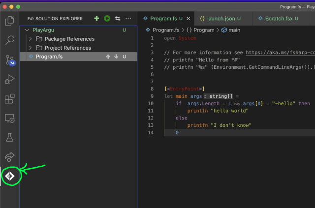

第二回では [LEAP RDBMS : Home](http://leap.sourceforge.net/) のようなrelational algebraの処理系を作ってみます。
いわゆるリレーショナルデータベースのおもちゃを作る感じです。
名前をtoyのrelational algebraという事でToyRelと呼ぶ事にします。

なおLEAPを題材にRelational Algebraやデータベースの基礎を教える本として、以下があります。

<iframe sandbox="allow-popups allow-scripts allow-modals allow-forms allow-same-origin" style="width:120px;height:240px;" marginwidth="0" marginheight="0" scrolling="no" frameborder="0" src="//rcm-fe.amazon-adsystem.com/e/cm?lt1=_blank&bc1=000000&IS2=1&bg1=FFFFFF&fc1=000000&lc1=0000FF&t=karino203-22&language=ja_JP&o=9&p=8&l=as4&m=amazon&f=ifr&ref=as_ss_li_til&asins=B00OD5CB50&linkId=031b79722ee8b82c89df4ef320cc8118"></iframe>

ちょっと高くて古い本ですが、ちゃんと基本的なrelational modelやrelational algebra関連の理論がまとまっていながら不要に難しいと思う所はちゃんとカットしていたりと悪くない本なので興味があったらどうぞ。
自分は第二回の内容を書く為に買いました。

なお、第二回をやるのに特にこの本の内容を前提にはしません。
上のリンクから買ってくれるとちょっとアフィリエイトが入って嬉しいくらい。
牛の本とか持ってるなら買わなくてもいいと思います（自分は昔読んだが捨ててしまって手元に無い…）

## ToyRelとrelational modelとrelational algebra

RDBの基礎は、relational modelとrelational algebraです。
relational algebraについてはWikipediaの記事でもだいたいは理解出来るでしょう。

[Relational algebra - Wikipedia](https://en.wikipedia.org/wiki/Relational_algebra)

より詳細なRelational algebraについては上記書籍や、ググって引っかかる講義資料などを参照してもらうとして、
ここでは実装上の簡単な説明を行います。

relational modelとは「データベースのテーブルというのは、なんらかの制約を満たしたタプルの集合とする」というモデルです。
タプルというのはテーブルのrowの事。
リレーショナルモデルとは、rowが重複しないテーブルと思っておけばだいたいよろしい。
このテーブルを一般化した概念をリレーションと呼びます。

この重複しないという制約のおかげで集合論的にリレーションを定義出来る、
というのがrelational modelのポイントその1です。

そしてrelational algebraというのはこのrelational model同士を演算して新しいrelational modelを作るという合成方法です。
relational algebraの各演算がまたrelational modelを返すので、この演算は代数をなす、という事ですが、
実装的に重要なのは、演算の結果もテーブルも区別がなく同じrelational modelになる、という事です。

ToyRelとしては、relational modelとしてcsvファイルを使います。relationの名前として、csvファイルのbasename、つまり拡張子を取り除いたものを使います。
カラムの型としてはとりあえずIntとStringだけ考えています（Floatもサポートしたくなったら追加するかも）。
最初から提供するcsvはリレーションとしてvalidなものだけに限定し、そしてrelational algebraの結果生成されるrelationも必ずvalidなものだけを吐くとします（つまりrowの重複は毎回取り除く）。

実装するrelational algebraとしては、以下を実装する事にします。

- project
- restrict (第一回でfilterと呼んでたもの、RAではselectと呼ばれる事も多い)
- union
- difference
- intersect
- rename
- product
- join

また、relational algebra以外のコマンドとしては以下を実装します。

- use (db変更)
- print
- list

本格的なrelational algebra処理系となるので、全仕様を最初に詳細に決めるのは難しいし理解をするのも大変です。
そこで、これを徐々にすすめていく過程で何を作るかを明らかにしていこうと思います。



**みんな大好きRelational Algebra**  

実装の上ではあまり理論を知る必要も無いのですが、数学的には非常に単純なので理解も容易で、
けれどその表現力の高さや実社会に与えた影響の大きさという点からも、
Relational Algebra（略してRA）は学ぶ意義の多いものに思います。

現代の観点からするとテーブルを抽象的にテーブルと考えるという事自体が普通に感じられすぎて、
どこが革新的なのかが分かりにくい。
けれど当時の、皆が生の多次元配列をいじってこうしたシステムを実装していて、
実装言語の違いや保存の方法などによってうまれる配置やアクセス方法の違いから、
一般的な記述をするのは簡単な事ではありません。

そうした時に、ドメインの間を動くタプルとその制約という形で全ての必要となる「なにか」を記述出来る、
というのは、単純でありながら十分な力を持ったエレガントなモデリングであり、
こんな単純なモデルで非常に多くの問題が記述出来るというのは驚きに値します。

以下からリンクされているTuring Award Lectureのpdfを見ると、当時の状況とこの理論の距離感のようなものが垣間見えます。

[Edgar F. Codd - A.M. Turing Award Laureate](https://amturing.acm.org/award_winners/codd_1000892.cfm)

Relational Modelのポイントとしては、テーブルを

- タプルが所属するドメインの全集合
- リレーションが満たすべき制約としてのpreposition

の２つと考える事です。
例えばサイコロの目の集合という全集合に対して、
「偶数の目」というprepositionを満たす集合、というのは、
`{2, 4, 6}` という集合と同じとなります。
これは極めて普通の集合論の言葉でありながら、
プログラムの実装としてもタプルとそのフィルタという形で自然に実装が出来ます。

この数学としての単純さと実際の実装の近さというバランスの良さがRelational Modelが優れていた所でしょう。

集合論として単純な定式化が出来たおかげで、その時に使われていたデータベースシステムがサポートする演算達に対して、
それと同じ表現力を持つ最小の基底の数やその基底を調べる事が出来たり、
新しい演算を考えた時にそれが既存の演算で表現出来るか調べたり、
類似のモデル同士の表現力が等価なのかどちらかがより広い範囲をカバーしているのかなどが証明出来たり出来るようになりました。
また複雑な合成を変形しても等価になるような最適化に使える変形などを調べるなどのご利益もあります。

数学としては非常に入門的なdifferenceやunionなどばかりで、直和などの良く分からん難解なものにも慣れ親しんでいる皆様からすると、
おもちゃみたいな代数でしょう。
プログラムにおいて数学を活かす難しさというのは、出来上がった数学の難解さよりは、
現実の問題に直面して実装に引きずられがちな所に、
一歩下がって数学的な構造を見抜く所にあるという事が読み取れる例です。

実装する側としては、一般的な（数学の意味での）ドメインの上を動くタプルに対して、
ある種のフィルタを適用したものとしてリレーションが生成出来るという事に着目しておくと、
以下で様々な機能を実装していく時に統一的に考える事が出来ます（別にそんな事考えなくても実装は出来ますが）。
全てのリレーションがこの形で統一出来るというのは素晴らしい発明なのですが、
実装する側としてはそんな難しい事は考えなくても、全部同じ枠組みで実装すれば良いだけです。

ちなみにRelational Modelではrowをタプルと呼んでいて、カラムをattributeと呼んでいます。一応知っておくと文献を読む時に楽です。

なお、クエリとしてはほぼ完成されているRelational ModelとRelational Algebraですが、
テーブルの設計としては少し抽象的過ぎて重要なセマンティクスの幾つかを失ってしまってもいます。
そこでテーブル設計としてはRelational Modelの問題点を解決した後発のEntity-Relationshipモデルが一般的に使われています。
ERとかEAR(Entity-Attribute-Relationship)と良く略されていますね。
ER図とかERDとかは実務でも良く出て来るので見た事がある人も多いと思います。このRelationshipがRelationと似ているので混乱しやすいので初学者は注意が必要です。
両者は関連しているので類似している訳で、primary keyを導入する事でEntityをRAの意味でのRelationで表現するというのはテーブル設計の基礎ですらありますが。

この辺の理論的な話を真面目に学ぶならDBの教科書、たとえば先述のTheory and Practice of Relational Databaseは良い本だと思います。
ERDに関しては理論だけでは無くて訓練も重要で、そうした演習書としては楽々ERDレッスンが優れていると思います。

- [楽々ERDレッスン 第1回：「お持ち帰りご注文用紙」編：CodeZine（コードジン）](https://codezine.jp/article/detail/154)
- [楽々ERDレッスン 第2回：「図書館の予約申込書」編：CodeZine（コードジン）](https://codezine.jp/article/detail/175)

この記事を拡充して書籍化された以下の本を若かりし頃、頑張って練習しました。Kindle化されないですかね〜。

<iframe sandbox="allow-popups allow-scripts allow-modals allow-forms allow-same-origin" style="width:120px;height:240px;" marginwidth="0" marginheight="0" scrolling="no" frameborder="0" src="//rcm-fe.amazon-adsystem.com/e/cm?lt1=_blank&bc1=000000&IS2=1&bg1=FFFFFF&fc1=000000&lc1=0000FF&t=karino203-22&language=ja_JP&o=9&p=8&l=as4&m=amazon&f=ifr&ref=as_ss_li_til&asins=4798110663&linkId=d16b70a4d08fd1e3da37295ee773b78f"></iframe>

なお、このToyRelではあえてRelational Modelそのままに近いものを実装していきます。
EAR的な要素は一切出さないように気をつけています。





## wikipediaディレクトリのデータ紹介

Wikipediaの[Relational algebra - Wikipedia](https://en.wikipedia.org/wiki/Relational_algebra)と同じデータを、
sources/data/wikipedia下に置きました。

詳細はWikipedia側を見て下さい。

なお、先述の書籍、Theory and Practice of Relational Databasesのサンプルのデータもsources/data/tandpに作ってあります。
ある程度実装が進んだらこちらも触ってみて下さい。
詳細は[tandpデータの解説と練習問題など](tandp.md)を参照の事。

## こんなものを動かしたい、というイメージ

以下のような処理を実行すると、ランダムに生成された名前のrelationが保存されます。

```
> project (シラバス) 専門, 学年
Relation zzybac returned.
```

名前はこの場合zzybac.csvというファイルになります。
リレーションはprintで表示出来ます。

```
> print zzybac
専門   学年
----  ----
数学    1
物理    1
数学    2
```

同じ行は削除される事に注意。

なお、この第二回では基本的に、入力を`>`のあとの行で行って、結果は`>`の無い行として表示します。
終盤では実際にそうした入出力を実装するつもりですが、この時点では表記上の便宜と思っておいてください。

リレーションは変数に入れる事もできる。
以下のような文を実行すると、

```
> シラバス_専門_学年 = project (シラバス) 専門, 学年
```

「シラバス_専門_学年.csv」というファイルが生成されて、中身は先程と同じ。

differenceなどはwikipediaディレクトリのデータを使うと以下のような感じになる。（Wikipediaの記事の方も参照の事）

```
> emp_dept = project (Employee) DeptName
> dept_dept = project (Dept) DeptName
> (emp_dept) difference (dept_dept)
Relation zzaabc returned.

> print zzaabc
DeptName
----
Human Resources
```

以下のように書いても同じ結果になります。

```
> (project (Employee) DeptName) difference (project (Dept) DeptName)
```


あまり考えずに書いているので、実装してみるともうちょっと仕様は変わるかも。


## プロジェクトの名前と場所

とりあえずプロジェクトの名前はToyRelとしましょう。
作る場所はsourcesの直下にします（PlayDeedleなどより一つ上のディレクトリになることに注意）。

ブランチは`toyrel/...`の形式の名前にしていきましょう。

また、FParsecとDeedleはfsprojに加えておいてください。（Arguは今回は使わないのでいいです）

### databaseという概念

将来的には複数のデータベースというのを持てるようにしたいと思っています。
データベースはリレーションの集まりです。
ディレクトリをデータベースとして扱いたい。

useでデータベースを切り替える。

例えばシラバスや成績などの「講義成績」データベースとか、住所とオーダーの「注文システム」データベースなどというような。

ただ当面はとりあえず一つとしたい。その辺の事を意識しつつ、けれどまずは簡単な構成にしておきましょう。

ToyRelのプロジェクトにdatabase/masterというディレクトリを作って、その中にsource/data/wikipediaのcsvと `シラバス.csv` をコピーするシェルスクリプトを作り、
普段の作業はそれに対してやります。
開発時はちょくちょくクリアしたくなると思うので、スクリプトはディレクトリを削除して作り直す所からやる感じにしておいてください。

setupdb.shとかそんな感じの名前でコミットしてください。別にbatファイルでもps1ファイルでもいいです。

当面はここのパスを決め打ちで作業していきます。
つまり、"シラバス"といったら、`source/ToyRel/database/master/シラバス.csv`を意味します。

なお、このdatabase下は実装が進むと変数名に対応するファイルがどんどん保存される事になるので、このディレクトリはcommitしないで.gitignoreに入れておいてください。

## identifierのパーサーを実装する

まずはウォームアップも兼ねて、identifierのパーサー、pIdentifierから実装しましょう。

identifierというのは普通の言語では変数や関数名に使われるなにか、を意味します。
例えば以下のident1とかident2とかident3の場所に来るのがidentifierです。

```
ident1 = project (ident2) idnet3, ident4
```

左辺の変数名、projectの引数のリレーションの名前、projectの引数のカラムの名前などで使われます。
（ただしカラムの名前は空白が入る場合などはidentifier以外の表記も可能）。

この左辺のident1はそのままident1.csvというファイルに保存する仕様にする予定なので、
identifierはファイル名として使えるものである必要があります。

細かい所は違っていても良いのですが、注意したい事としては

- 1文字目数字は禁止とする（パースで数字の即値と区別が難しいのでだいたいの言語では禁止されている）
- カタカナや漢字を使いたいのでその辺は真面目に対応する
- .やスペース、スラッシュやバックスラッシュ、シングルクオートやダブルクオート、コロン、セミコロン、アスタリスクなどのファイル名としてやばそうな物は禁止する

という所は満たしたい。

例で出てくるようなのは対応した上で、わかるものだけ受け入れる、つまり「怪しいものをはじくでは無くて安全なものを受け入れる」という風にパターンを書くと良いでしょう。
全ての怪しいケースを調べ上げるのはだいたい不可能なので、
「安全とわかっているものだけを受け入れる」は、入力を扱うプログラム全般で言える原則です。

大雑把には以下みたいな感じかなぁ、と思います。

```
identifier = nondigitchar normalchar*

nondigitchar = ([a-zA-Z]|p{IsHiragana}|p{IsKatakana}|p{IsCJKUnifiedIdeographs})
normalchar = nondigitchar | [0-9_]
```

以後このように、第二回ではふんわりした文法のようなものが提示される事がありますが、これはあくまでアイデアを伝える為のものであって、
実際に実装する時にはちゃんと自分なりに考えて良さそうな文法にしてください。
とくに、途中の文法要素を表すようなものを間に導入したりした方が良い場合は多いと思います。

IsHiraganaとかは次の「正規表現の文字クラスで遊ぼう」で解説します。

### 正規表現の文字クラスで遊ぼう

さて、pIdentifierにはひらがなとかカタカナとか出てくるので、正規表現を使うのが良さそうです。
FParsecではregexという関数に正規表現の文字列を渡すとそれにマッチするパーサーを返してくれます

```
let pNum = regex "[0-9]+"

run pNum "123abc"
```

こんな風に正規表現さえ分かれば、それからパーサーを作る事はかんたんに出来ます。
そこで目的のidentifierにマッチする正規表現を書ければ良さそう。

正規表現自体は知っていると思うのだけれど、ひらがなとかカタカナとか漢字というのはなかなか知らない人も居ると思うので、
ここではちょっとその辺をつついてみましょう。
こういう時はScratch.fsxで書いてみるのが良い。

F# では正規表現には別段特別な何かは無く、.NET のRegexクラスを使います。

まずは以下のコードをScratch.fsxで実行してみましょう。

```
open System.Text.RegularExpressions

Regex.IsMatch("123abc", "[0-9]+")
```

IsMatchは第一引数に対して、第二引数のパターンがマッチするかどうかを調べます。
どこがマッチしたかを知りたければMatchを使います。

```
Regex.Match("123abc", "[0-9]+")
```

ただ今回は文字クラスになれるのが目的なのでIsMatchで十分でしょう。

ひらがなにマッチする正規表現は、「文字クラス」というもので指定出来ます。`\p`のあとに中括弧でくくくって文字クラスを書くと、それにマッチします。
たとえばひらなな一文字は`\p{IsHiragana}`でマッチします。
試してみましょう。

```
Regex.IsMatch("あ", "\p{IsHiragana}")
Regex.IsMatch("ア", "\p{IsHiragana}")
```

これは通常の文字のパターンとして、他の正規表現と組み合わせる事が出来ます。
例えばひらがなかカタカナ一文字とマッチさせたければ、縦棒でつなげれば良い。

```
Regex.IsMatch("あ", "\p{IsHiragana}|\p{IsKatakana}")
Regex.IsMatch("ア", "\p{IsHiragana}|\p{IsKatakana}")
Regex.Match("あアほげいか123", "(\p{IsHiragana}|\p{IsKatakana})+")
```

123にはマッチしてない事に注目してください。

どんな文字クラスがあるかは以下に一覧がありますが、膨大なので使う予定のものだけ見るくらいでいいでしょう。

 [.NET 正規表現での文字クラス - Microsoft Docs](https://docs.microsoft.com/ja-jp/dotnet/standard/base-types/character-classes-in-regular-expressions#SupportedNamedBlocks)


### 課題0: identifierにマッチする正規表現を書け

identifierにどういうものがふさわしいかは、「こんなものを動かしたい、というイメージ」の用途を考えた時にどんなのならいいのかを考えて自分で決めて下さい。
ようするにファイル名として有効で変数名としても有効で、csvのカラムの名前としても大多数はサポート出来るのが良い。

仕様自体は自分で考えてそれっぽいのを決めて欲しいですが、以下には全体マッチして欲しい。

```
abc
_abc123
abc_123
専門
フロア
```

そして以下には全体マッチはしないで欲しい（.や*はその手前までマッチはしても良い）

```
123
abc.def
abc*
abc:def
abc def
(abc)
abc+def
```

ブランチ名は `toyrel/1_pexpression` でお願いします。

なお、github上で私が見るために、どれはマッチしてどれはマッチしなかったのかをScratch.fsxのテストコードの上にコメントを書いてください。（一言コメントでいいです）

### 正規表現とregexを使ってpIdentifierを作る

正規表現さえ出来てしまえば、FPrasecのregexを使ってそれにマッチするパーサーが作れます。
正規表現は上で作った課題に差し替えてもらうとして、以下みたいな感じで作れるでしょう。

```
let pIdentifier = regex "[_a-zA-Z][0-9a-zA-Z_]*"
```

FParsecのregex関数について知りたければ以下を見てみて下さい。

[FParsec.CharParsers](https://www.quanttec.com/fparsec/reference/charparsers.html#members.regex)

## projectを簡易的に実装してみる

さて、pIdentifierが出来たら、Relational Algebraで一番簡単そうな、projectから実装してみましょう。

projectは最終的にはかなり本格的なExpressionの仕様が必要になりますが、いきなり最終形を考えるのは良いプログラムのスタイルではありません。
まずは小さく限定的な仕様から始めて、徐々に本格的に育てていくのが良い。

ここで考えるべき限定的な仕様としては、なるべく以下の性質を満たしたものが良いです。

- 最終的な仕様としてもvalidな限定的なケース
- 実装が一番簡単なケース

という事でここでは、そんな暫定的な仕様から始めたいと思います。

### projectの文法

projectは最初の引数がカッコでくくったexpressionというもので、そのあとにカラムの名前のリストが並びます。
expressionは後述するので後回しにして、それ以外は以下のようなイメージ。

```
project_expression = 'project' expression columnlist

columnlist = column
  | column ',' columnlist

column = '[' string ']'
     | identifier

```

stringとかはまぁ適当に(閉じ大かっこ以外とかでいいと思う)。

columnの名前としてはファイル名で使えないものが含まれていてもいいのですが、
それは大かっこでくくる方で対応したい。という事で大かっこでくくらなくていいケースはidentifierで十分でしょう。

なおLEAPではcolumnlistはカッコでくくっていたけれど、toyrelではここのカッコは無しで行きたいと思います。たぶん要らない気がするので。

という事でとりえあず一番下のcolumnから実装していきましょう。

### pColumnの実装

さきほど作ったpIdentifierを使って適当に大かっこの方のパーサー、pSBracketColumnとつなげればpColumnになりそうです。

```
let notSBracket s = s <> '[' and s <> ']'
let pSBracketColumn = (str "[") >>. many1Satisfy notSBracket .>> (str "]")

let pColumn = pIdentifier
           <|> pSBracketColumn
```

pSBracketColumnの定義は適当に今書いたので、もうちょっと真面目に考えた方がいいかもしれません（別にこのくらいでもいい気もしますが）。
名前はもう少し考えたいかも。

SQLなどでは大かっこはフィールド名に空白などが入っているケースで使われます。なので空白は含んだ名前がパース出来るといいでしょう。
例えば`[理学部 物理学科]`みたいな。

今回いろいろと仕様を自分で考えて実装してもらう事になりますが、基本的には以下のように考えるといいでしょう

- SQL的に普段使いそうなものが入っているか
- サンプルで出てくる例は入っているか
- csvに変なのが入っていた時におかしく振る舞うのはOKとする（勉強目的なので実装が簡素な方を重視）

### expressionの暫定的な仕様

expressionは中を評価するとrelationになっているようなものです。
まず考えるべきは以下の２つです。

- リレーションの名前をそのままカッコでくくったもの
- projectなどの結果

例えば、１つ目の例は以下になります。

```
project (シラバス) 専門, 学年
```

この時、１つ目のカッコの中はリレーションの名前になります。

２つ目の例としては以下のようなものが考えられます。

```
project (project (シラバス) 専門, 学年, 場所) 専門, 学年
```

以上をそのまま書くと以下のようになります。

```
expression =  '(' identifier ')'
           |'(' project_expression ')'
```

さて、これをそのまま実装しようとしてみると、pExpressionを実装する時にはpProjectExpressionが必要で、
pProjectExpressionを実装する時にはpExpressionが必要になってしまいます。

文法的は再帰で定義していくものなので、左再帰で無い限りは再帰は問題無いはずですが、
実際にどのように書けば良いでしょう？

そこで出てくるのが `createParserForwardedToRef` です。

### createParserForwardedToRefを使ってexpressionの再帰を解決する

expressionの定義にはproject_expressionが必要で、project_expressionの定義にはexpressionが必要、
という状態を解決する為の機能として、FParsecには `createParserForwardedToRef()` という関数が提供されています。

これは、実体の無い仮のパーサーを返して、とりあえずそれを使ってルールを定義したあとに、その定義したルールを使って仮のパーサーの実体をあとから定義する、
という事を可能とします。

例として、pExpressionを仮のパーサーとして生成してpProjectExpressionを定義してみましょう。

```
let pExpression, pExpressionRef = createParserForwardedToRef()
```

Refについては後述します。こうやって得た仮のパーサーを使ってpProjectExpressionを定義する。

```
let pProjectExpression = (str "project") >>. pExpression .>>. pColumnList
```

このように、まだ定義していないpExpressionを使ってpProjectExpressionが定義出来ました。

次に、このpProjectExpressionを使ってpExpressionを実際に定義します。
この実際に定義する時に重要になるのが先程 `createParserForwardedToRef()` で得た二番目の戻り、 `pExpressionRef` です。
これは変更という副作用が必要なので通常のletでは無く`<-`を使います。（FParsecのチュートリアルでは`:=`が使われていますが、[F# 6ではdeprecated](https://docs.microsoft.com/en-us/dotnet/fsharp/language-reference/symbol-and-operator-reference/#reference-cell-operators-deprecated)となっています。）

```
pExpressionRef.Values <- (pstring "(") >>. pidentifier .>> (pstring ")")
                         <|> (pstring "(") >>. pProjectExpression .>> (pstring ")")
```

この右辺でpProjectExpressionを使っている事に注目してください。

もちろんこのまま書くと、pidentifierとpProjectExpressionの返りがコンパチブルじゃない的なエラーが出てくると思います。
でもその解決はここまで進めた読者なら自分で出来るでしょう。

### 課題1: pExpressionとpProjectExpressionをここまでの仕様で完成させよ

ちゃんと返す型も作ってください。
パースだけでいいです。ちょっと大きめの課題なので、一気に出来ないようなら言って下さい。分割します。

以下がパース出来る事を確認してください。

```
project (project (シラバス) 専門, 学年, 場所) 専門, 学年
```


**型が相互に依存する場合の書き方（andを使う)**  

さて、この課題では、場合によってはExpressionがProjectExpressionを参照するけれど、
ProjectExpressionではExpressionを参照したい、という事が起こる人もいるでしょう。
こういう時に、F#ではandを使うトリックで定義する事が出来ます。

例えば以下のように書くと、

```
type CalculatorState = {
     display: CalculatorDisplay
}
and CalculatorDisplay = string
```

CalculatorStateの中でまだ出てきてないCalculatorDisplayを使う事が出来ます。
同様に相互を参照するような型もこの方法で定義する事が出来ます。

このandを使った例についてのもう少し詳しい解説は、
[Calculator Walkthrough: Part 1 - F# for fun and profit](https://fsharpforfunandprofit.com/posts/calculator-design/#defining-the-calculatorstate-type)の「Defining the CalculatorState type」のあたりに書いてあります。



### 第一回と同じ感じのprojectでdfを返す所まで実装してみよう

まずは第一回と同じように、ProjectExpressionを処理する関数を作ってみましょう。rowはこの時点では重複があってOK。
擬似コードっぽく関数の型を示すと以下みたいな感じでどうでしょう？

```
evalExpression: Expression -> Frame
evalProjectExpression: ProjectExpression -> Frame
```

パイプでdfを流していくと思うので、引数の順番は expr dfがよさそうか。

evalExpressionはパターンマッチしてこの時点ではリレーションの名前のみとProjectExpressionに処理を分岐。どちらもdfを返す。
リレーションの名前のみの場合は、そのリレーションを開いてdfを返す。ProjectExpressionの場合は、evalProjectExpressionを呼んでdfを返す。


evalProjectExpressionでは最初のExpressionの処理でevalExpressionを処理するので、相互再帰になりそうです。

相互再帰は以下でどうにかなりそうか？

[Recursive Functions: The rec Keyword - F# - Microsoft Docs](https://docs.microsoft.com/en-us/dotnet/fsharp/language-reference/functions/recursive-functions-the-rec-keyword#mutually-recursive-functions)


**無限の再帰で計算が進まない！という事にならない為の基本的な考え方**  

文法では再帰の定義を行います。
また、F#では型も良く再帰的に定義されます。
また、F#では今回のように関数が再帰する事も良くあります。

この手の再帰について書く場合には、意図せず無限に再帰になって計算が前に進まない、という事にならないように気をつける必要があります。

再帰の表現力は非常に高く、一般に再帰が止まるかどうかを判定するのはややこしい問題ですが（型付けが無い場合は不可能、型付きなら強正規化定理で可能だった気もするけれど詳細は忘れました）、簡単に計算が進むのがわかるようなサブセットの範囲でプログラムを記述するようにする事で、
実用的な問題の多くはカバー出来ます。

再帰を書く時に自分が気をつけている事としては、

1. パターンのどれかは１段下の概念になるようにし、それをパターンの上の方に並べる
2. 再帰する時には１段計算が進んでいるものを渡すようにする（ちゃんと一つ計算が進む事を見直して確認する）

という事です。

例えばevalExpressionではまずリレーションの名前だけのケースを先に処理し、evalProjectExpressionを呼ぶ時には必ず元の引数をunwrapして一つ進めたなにかを渡している事を確認する、という具合です。

全ての問題をこう書ける訳ではありませんが、結構多くの問題をこう書けるものです。
また、なるべくこう書こう、と注意していると、そう書けない所には特別注意を払う事にもなるし、
どうしてそう書けないかを考える過程で良く問題を考えられるので、
そう書けないケースでも計算が進まない再帰を書いてしまうのを防ぐ役に立ちます。




## rowをdistinctにする

さて、ここまでだと、rowに重複が生まれる場合があります。
例えば以下のようにすると、

```
> project (シラバス) 専門, 学年
```

「数学,1」などの行が複数残るはずです。
Relational Algebraとしてはこうした重複は削除する必要がある。

そこでdfを渡して、rowの重複を除去したdfを返す、distinctを作りましょう。

distinct関連はListやSeqにdistinctという関数があるので、
それを使うのが良さそう。

[Seq (FSharp.Core)](https://fsharp.github.io/fsharp-core-docs/reference/fsharp-collections-seqmodule.html#distinct)

という事でRowsをまずはSeqにして、それをSeq.distinctを使って、そのあとdfに戻す感じにしましょう。

### rowの比較周りの話

Deedleのrowは内容が同じなら違う行でもイコールの比較はtrueを返します。
例えば以下を実行してみてください。

```
let df = Frame.ReadCsv "../../data/シラバス.csv"
let rows = df.Columns[ ["専門"; "学年"] ].Rows.Values |> Seq.toList

rows[0] = rows[1]
```

行が違っていても、値が同じであれば両者はイコールとなります。
ハッシュ値も同じになります。

### 課題2: dfのrowを一意にしたdf2を返す、distinctを作れ

まずは、以下のような感じで、単純にdfのrowをdistinctにする関数を作りましょう。

```
type Distinct = Frame -> Frame
```

この手の表記の見方を簡単に。
まずこれは実装する目標となる関数の型を表しています。
型の名前は大文字始まり。

そして実際の関数は先頭を小文字にした関数名で実装するのがコンベンションです。
つまりこの場合は、以下のような実装になる。

```
let distinct df = ...
```

上記のtype文は基本的には使わなくていいです。
使う場合はdistinctを例えば以下のような定義に変えれば使えます。

```
let distinct: Distinct = fun df ->
```

Distinctを使わない定義の方が実装が簡潔なので、別に使わなくてもいいです。
ただこの形にするとdfなどが型推論で型がtype定義から引き継がれるので、
いちいちdfに型指定しなくてもFrame型になるというメリットはあります。

## Relation型を作る

さてこのままではrowが重複しているdfとしていないdfが、型の上では区別出来ません。

F#では、ある型の変数がなんらかの制約をもったサブセットになっている場合は、
なるべくそのサブセット用の型を作る方が望ましい。
間違って想定しているサブセットで無い値が来ない事をコンパイル時に保証する為です。

ある型の変数を作る所で必ず制約を満たしているかチェックすれば、それ以後はその型が全てその制約を満たしている、と考える事が出来ます。
特にimmutableに書いていれば一度満たした制約が満たされなくなる事は無いので特にそうです。

このrowが重複していないFrameは、Relational Algebraの用語では「Relation」と言います。
そこでここでも、rowが重複していないFrameを表すRelationという型をつくりましょう。

Relation型の作り方は２つくらい考えられます。

- 普通にRelation型を作る
- module RelationのT型とする

いい機会なので、上と下のやり方でそれぞれどう違うかを試してみましょう。
まずは上のやり方でやってみます。

### 課題3: Relationの型をつくれ

ブランチ名は `toyrel/3_relation_type`でお願いします。

Relationを普通のsingle case unionで作り、中身はFrameでいいでしょう。
generics型もreadCsvして返ってきた型を参考に具体的に指定してしまって良いと思います。

single case unionについては以下を参照の事。

[Single case union types · F# for Fun and Profit](https://swlaschin.gitbooks.io/fsharpforfunandprofit/content/posts/designing-with-types-single-case-dus.html)

このRelationを使ってdistinct, project, あとcsvをロードする関数(readCsvしてdistinctするなにか）を書いてみましょう。

### Relation型を作る意義などについて考える

Relationのように解いている問題領域で使われている語彙の型を作るというのは、多くの場合に良いアイデアです。
今回ではRelational Algebraの問題を解いているので、Relational Algebraの論文（Relational Modelの論文）に出てくる概念を型にした方が良いと思える時には、
積極的に作っていきたい。

Relationの型のように、Frameの中で特定の性質を満たしているもの、というような、ある型のサブセットを表すような型を作る時には、
Relation型の変数を作る関数を一つだけ作り他の場所ではそれを使うようにし、
そのRelation型の変数を作る関数で制約をチェックするというのがおすすめの方法です。

エラー処理などは最初のうちは手抜きでfailwithで落としたりすると思いますが、
そうした手抜きの場所がコード全体に散らばるのでは無く特定の関数に局所化しておく、
というのが、あとに真面目に処理するように変更する時にも重要です。
型でそうした対応をしなくても良い部分が明確になっているのは重要です。

制約を満たしている範囲内での大多数のコードと、それと外の世界とのやり取りをする少数のコード、
というふうにコードを分割するように心がけると良いでしょう。

以下の冒頭は、同じような解説があるので読んでおくと良いです。

[Calculator Walkthrough: Part 1 · F# for Fun and Profit](https://swlaschin.gitbooks.io/fsharpforfunandprofit/content/posts/calculator-design.html)

また以下は、少し長いですがとても良く書けているのでおすすめです。

[The "Designing with types" Series · F# for Fun and Profit](https://swlaschin.gitbooks.io/fsharpforfunandprofit/content/series/designing-with-types.html)

### moduleを使って抽象データ型を作る

Relationという型を作ったけれど、現状ではRelationという型を作るのに使う関数は必ずこれを使う、
などという事は、コードの上では分かりにくいと思います。
またdistinctなどはこの関数以外では使いようが無い事も分かります。

また、例えば以下のような関数があれば、

```
type ToFrame: Relation -> Frame
```

それ以外の所ではRelationの型がどういうふうに構成されているかを知る必要は無い。

このようにある型とその型に対する操作だけをもって型とみなす考え方を抽象データ型（Abstract Data Type, ADTと略す事も）といいます。
そして型を抽象データ型にする事をdata abstractionと呼びます。

抽象データ型自体は紳士協定でも成り立つ考え方ですが、ここではより抽象データ型である事がコード上で明白になるように、
moduleを使う手法を使ってみましょう。

具体的には以下のあたりを参考にすると良いでしょう。

- [Single case union types · F# for Fun and Profit](https://swlaschin.gitbooks.io/fsharpforfunandprofit/content/posts/designing-with-types-single-case-dus.html)の「Creating modules for wrapper types」のあたり


### 課題4: module Relationを作りADTしよう

こちらもブランチは課題3と同様のものを使ってOKです。比較したいので。という事でブランチ名は `toyrel/3_relation_type`のままでお願いします。

Relationという名前のmoduleを作り、そこにTという型をつくり、Relationの中を知る必要のある関数をこのモジュールにまとめましょう。
そしてprojectなどはRelation.Tを使うように書き直してみましょう。

このmoduleを作って整理したコードと課題3のコードを比較してみましょう。整理していく過程で、より自然に構造が出来ていくように感じませんでしたか？


**抽象データ型の話**  

型というものがその関連する操作によって定義されるという考え方を、Abstract Data Typeといいます。
型がもともと集合を表すようなものとするなら、ある演算を満たす集合を考えるというのは代数構造を考える事になれた人にとっては自然な考えでしょう。

抽象データ型というのは非常に強力な考え方で、F# では頻繁に出て来ます。
そしてこの抽象データ型をどういうふうにより抽象にしていくか、と考えるのは、プログラムを書いていく時の良い考え方です。

例えば上記のToFrameなどはあまりに直接的過ぎて、あまり抽象度は高くない。
何が良いか、というのは、実際に使う側のコードを見て考えます。
使う側がみんな似たような処理をしているなら、それは抽象データ型の方のモジュールに移す方が良いかもしれません。

結果として、例えばRowのValuesあたりを取る関数と、それらからRelationを作る関数、という組み合わせの方が適切だ、
と感じるかもしれません。
こういうのは最初に良い抽象をバーンと思いつくというよりは、
書いた使う側のコードを眺めて、それをもとに考えていく、という、プログラムという作業の中で継続的に行っていくべき作業です。

抽象データ型については以下にも解説を書いてみました。
特にJavaとかJavaScriptとかの言語に慣れている人には一度オブジェクトという事は忘れて抽象データ型を理解してみる事をおすすめします。

[blog: 抽象データ型とはなんぞや？](https://karino2.github.io/2022/07/28/abstract_data_type.html)



## リレーションの保存

toyrelではトップレベルで評価されたリレーションは必ずcsvに保存されます。
左辺の変数がある時はそれがファイルのbasenameになります。
左辺の変数が無い時はランダムで振られたファイル名になります。

まずは左辺が無いケースでランダムのファイル名に保存する場合を考えましょう。

### 課題5: まずは指定されたファイル名で保存する関数を作る

Relationを basename + ".csv"という名前でデータベースのディレクトリに保存する関数を作ります。
データベースのパスをどうするかはこの辺で考えてもいいかもしれない。

1. グローバルな変数にletで定義したものを使う
2. DB型のなにかを全関数の第一引数にわたす

この時点ではどっちでもいいです。
1の方がYAGNI的に正しい。2の方が関数の依存が型で表現されていて良い。
自分ならたぶん2だけどどちらが良いかは自分でも悩むくらいの感じですね。

とりあえず解説は1を前提に書くと、以下みたいな感じの関数をまずは作りましょう。

```
type Save = Relation -> string -> ()
```

### ランダムファイル名の生成の仕様

ToyRelでは、特に左辺を指定しない式を評価すると、ランダムの識別子に結果を保存しその識別子を返す、としたい（LEAPと同様の仕様）。

ランダムな識別子としては、長すぎず変な文字が無い無難なbasenameを作りましょう。
LEAPの仕様に合わせておくと、

- 最初二文字は"zz"
- 残り4文字をa-zからのランダムな文字で埋める

という感じにしましょうか。

### Randomクラスをいじる

ランダムなファイル名を生成するには、.NETのRandomクラスを使うのが良いでしょう。
以下を見ると、指定された範囲の数字を取る方法が書いてあります。

[Random Class (System): Retrieve integers in a specified range](https://docs.microsoft.com/en-us/dotnet/api/system.random?view=net-6.0#retrieve-integers-in-a-specified-range)

upper boundは含まれないようなので、+1したものを渡せばいいでしょうか。
Scratch.fsxで以下を実行してみてください。

```
open System

let r = Random()
r.Next( (int 'a'), (int 'z')+1)
char (r.Next( (int 'a'), (int 'z')+1))
```

最後の行を何回か実行してみてください。
また、端の+1の効果を調べる為にxからzまでを出力したりもしてみてください。

### 課題6: ランダムのファイル名を生成しよう

上記の仕様のランダムの文字列を返す関数を作りましょう。

注意する点としては、Randomのインスタンスは一回グローバルに作って、以後はそれを使い回すようにすべき、という事です。
そちらの方が連続で呼ばれた時に良い乱数が出来るので、
関数の中で毎回作ってはいけません。

### Relationの保存とprintの仕様

ToyRelでは、左辺の無いExpressionは全てランダムの名前に保存され、その名前が返されます。
保存されたRelationを表示するには、専用のprintというコマンドを使うという仕様にしたい。

例えば以下のようなexpressionを実行すると、

```
> project (シラバス) 専門, 学年
```

以下のように表示されるだけで、結果は表示されない。

```
Relation zzybac returned.
```

結果を表示するには以下のようにprint命令を実行する。

```
> print zzybac
専門   学年
----  ----
数学    1
物理    1
数学    2
```

という事で、このようになるように保存とprintを実装していきましょう。

printとしては、いつもidentifierが来るだけ、でいいでしょうかね。
文法的には以下みたいな感じでどうでしょう？

```
print_stmt = "print" identifier
```

という事で以上を前提に保存とprintを実装していきましょう。

とりあえずstmtと呼びましたが、他の名前でも良いです。Expresisonでは無いなにか、という事が分かれば良い。
こういう時に良く使われる用語としては、ステートメントとかコマンドとかですね。

### 課題7: 保存とprintを実装せよ

この辺からは割と本番コードという感じなので、ブランチ名を固定したいと思います。
以後ブランチ名は `toyrel/main`でお願いします。

保存については現時点ではまだ全体的な所が見えていないので、
Relationを課題6で作ったランダムな名前に保存する関数を作り、
これを手動で呼ぶ、という事で実装してください。

そしてprint文をパースして実行しましょう。

printはexpressionでは無いので、Expressionの一部では無く、Expressionかprint_stmtのどちらかを持つ文法要素を上に作る方が良いでしょうね。

関数としては現時点では場合分けは手動でも良いです。
とりあえずprint_stmtをパースする関数と、
パースした結果を実行する関数を好きに作ってください。

なお、ランダムなファイル名は既存のファイル名とぶつかる可能性があります。
これはもう上書きしてしまう、という潔い仕様にしたい。
zzで始まる名前はシステムが使うテンポラリな名前、という事で。

### 課題8: 左辺を含むExpressionのパース

デフォルトではランダムのファイル名に保存しますが、ユーザーが指定する方法もあります。
以下のようにイコールの左辺に置く事で、それをファイル名として保存します。

```
> hoge = (シラバス)
```

この場合は `hoge.csv` になるようにします。
文法的にはこのhogeはidentifierとしてパース出来るものです。

まずは文法を考える所から始めましょう。
このイコールのある文も文法的にはprintと同じレイヤーのなにかになるでしょうか。

このケースでも、すでに存在するファイルがあったら上書きで良いです。


**仕様を簡単にする大切さ**  

プログラムにおいては、仕様を、実装が簡単になるように考えるというのは重要です。
例えばToyRelでは必ずリレーションはファイルに保存されて、名前を指定してもしなくてもほぼ同じような挙動になっています。
また、ファイルがすでに存在してもしなくても同じように上書きしてしまう仕様にしています。

これでは最初から定義されているテーブルとランダムなリレーションの名前がぶつかる事があるのでは無いか、という気もしますが、
それは最初の2文字をzzとする事でぶつからない名前というのを保証出来るようにし、最初からそういうファイル名は使わない、
という制約によりいろいろな面倒を省いています。

削除の周りをどうするか、というのは工夫の余地は多いものです。例えばgmailなどではメールは削除するとゴミ箱に入り、undoが出来ます。
以前のメールソフトでは削除の前にダイアログを出して問い合わせる事が多かったのですが、この周辺はバグも多く使いにくいものでした。
削除では無くゴミ箱に移動、という仕様にする事で、多くの面倒な問題を回避できるとともに、より使いやすくもなっています。

仕事の場合は仕様が他の要因で決まっている事も多くそこまでフリーハンドという訳では無いと思いますが、
それでも多くの場合は交渉の余地があるものです。
面倒な実装に直面した時は、「なんでこんなに面倒なんだろう。もっと簡単になるような仕様に出来ないかな？」と考えてみるのは大切な事です。

実装が簡単な仕様を考えられるようになる、というのは訓練で身につける、重要なスキルの一つです。
訓練方法としては、普段の仕事の時にある程度の時間を使って実装が簡単になる仕様を考える、という事をやっておくのが良いでしょう。
また、既存の多くの有名なソフトウェアはうまく実装が簡単になるような仕様になっている事が多いので、
そうした既存のソフトウェアの仕様を学ぶのも良い勉強になります。





### 課題9: listコマンドを実装する

以下のようにlist単体で、

```
> list
```

現在のデータベース内のリレーションの一覧を出力する、という命令を実装します。
これもprint_stmtと同様に、Expressionでは無いなにかですね。

## モジュール構成などを考える

そろそろ基本的な構成要素が揃ったので、モジュール構成などを考えます。

最終的に必要なものとして、文字列を渡すとここまで実装してきたものが動くような関数を作りたい（すでに作っている人もいるかもしれませんがそれは問題ありません）。
それを念頭にモジュール構成を考えていきます。

モジュール構成自体は好きにしてもらって良いのですが、いくつか参考になる事や以後の解説のために前提となる事を書いておきます。

### 参考になりそうな外部サイト

どういうモジュール構成にするのがいいのかは他人のコードを見るのも割と参考になります。とりあえず自分のプロジェクトで参考になりそうなのを挙げておきます。

- [karino2/csvplr: dplyr like unix command line tool for csv.](https://github.com/karino2/csvplr) これはやっている事が似ているが、規模が小さいのでいろいろ手抜き。
- [karino2/uit: Unique it file sync and manage system.](https://github.com/karino2/uit) こちらは割とでかいので、今回出てくるような問題は一通り解決されていると思うが、やっている事は結構違う。

また、似たようなトピックを扱うF# for Fun and Profitの記事も参考になります。

- [Organizing modules in a project · F# for Fun and Profit](https://swlaschin.gitbooks.io/fsharpforfunandprofit/content/posts/recipe-part3.html)
- [Refactoring to remove cyclic dependencies · F# for Fun and Profit](https://swlaschin.gitbooks.io/fsharpforfunandprofit/content/posts/removing-cyclic-dependencies.html)


### 基本的な構成

いくつかの選択には自由度があるところなのでそこは各自が考えてほしいですが、おおまかな方針は説明しておきます。

まずこれまでのコードを.fsファイルに構成していきます。
この時点では、パーサーと、パースされた結果を実行するもの、の2つが大きな構成要素としてあると思います。
とりあえずこれらを、Parser.fs, Eval.fsの2つに分けて、それぞれParserモジュールとEvalモジュールにしてください。

EvalはParserには依存せず、ParserもEvalには依存しないようにしたい。

他にもいろいろモジュールが必要になると思います。それらは各自で名前を考えて下さい。

### コンパイルの順序の設定

F#はコンパイルの時の順番に依存する言語です。
だからどの順番にコンパイルするかは指定する必要があります。

順番の設定は以下の左側のボタンを押して出てくるSOLUTION EXPLORERで行います。



ここでファイルを選んで、その横の上矢印、下矢印で順番を変える事が出来ます。
fsprojをエディタで開いて変更しても良いですが、UIからやる方が無難でしょう。

### 型や共通するものだけを入れたファイルを作る

モジュール間の依存を考えていくと、他のものに依存していないモジュール、というのが大切な事に気づくと思います。
自分はそういうものをCommon.fsというファイルに置く事が多いので、そうしても良いでしょう。

また、型の定義は普通何にも依存せずに書けるので、Types.fsという共通で使う型を定義するファイルを作るのも良くF#のプロジェクトでは見られます。

この辺は好きな方を選んで良いと思います。

### fsxからfsのコードを実行する

fsの方に移動しても普段はfsxから実行したい。
そういう場合にはloadを使います。

```
#load "Parser.fs"
```

これでParser.fsの内容をそこに書いて実行したかのように振る舞います。
moduleにした場合はそれまでのコードを動かすためにはopenする場合もあるでしょう。

```
#load "Parser.fs"
open Parser
```

一旦このようにScratch.fsxのコードを変更して動作を確認し、
次に必要に応じて`open Parser`文を削除してqualifierをつけていきます（この場合は`Parser.`をつける）。

### SmokeTest.fsxを作っても良いかもしれない

この辺で簡単なテストを作っておいてもいいかもしれません。
という事で自分が良くやる手法を紹介しておきます。

Scratch.fsxと連続性がある形でUnit Testをしたい、という事は良くあります。
そういう時に自分は良くSmokeTest.fsxというファイルを作って、そこで簡単なテストを実行する事にしています。

スモークテストとは、もともとはハードウェア開発などで電源を入れてみて煙が出ないかを確認する、というようなテストの事だったのですが、
ソフトウェア開発ではある程度の基本的な動作を簡単に確認するインテグレーションテストの一種をそう呼びます。
そこまで頑張ってテストを揃えるほどでは無いが、
Scratch.fsxで手動でやったテストを整理して記録しておくくらいはやっておくか、という気分をこめて、SmokeTest.fsxと呼んでいます。

F# でUnit Testをどうすべきか、というのは自分の中でもまだ試行錯誤中の所ですが、
どうも自分の印象ではfs側でやるのはScratch.fsxでのREPLベースの開発と離れすぎていて、あまり体験が良くない。

それよりはScratch.fsxで動作確認したコードを少し修正してスモークテストに組み込む方がうまく機能している気がする。

Scratch.fsxはいろいろなコードを書き捨てる場所ですが、SmokeTest.fsxはいつもファイル全体を選択して実行したら実行出来る状態を保つようにしています。

fsxで使う手頃なテストライブラリとかは自分は見つけられていないので、毎回簡単なものを作っています。

だいたいTestUtil.fsxというファイルにテストに使う関数をまとめて、
それをSmokeTest.fsxからロードして使う事が多い。
これはテストがfailした時に、Scratch.fsxでも実行したくなる事が多いからです。

この辺の事は、例えば以下のコードが参考になるかもしれません（別に全然違う感じに自分で好きに書いてもいいです）。

- [csvplr/TestUtils.fs at main · karino2/csvplr](https://github.com/karino2/csvplr/blob/main/TestUtils.fs)
- [csvplr/SmokeTest.fsx at main · karino2/csvplr](https://github.com/karino2/csvplr/blob/main/SmokeTest.fsx)
- [uit/SmokeTest.fsx at main · karino2/uit](https://github.com/karino2/uit/blob/main/SmokeTest.fsx) テスト用ディレクトリを作るあたりはこちらが参考になるかもしれない。


**REPL driven development**  

REPLとはread-eval-print loopの略ですが、
F#の文脈ではfsxを実行していく事を指す事になると思います。

REPL driven developmentは正確な定義のある言葉では無いと思いますが、
開発を主にfsx上で実行していきながら進めていくスタイルの事を言います。
Scratch.fsxでなるべくコードを実行していき、折を見てfsに整理していくスタイルはまさにREPL driven developmentと言えるでしょう。

Scratch.fsxで開発を続けていくと、途中のコードをどんどん変更していくため、だんだんと動かないコードが増えていくと思いますが、
あまりそれを整理するのを頑張るよりは、なるべくたくさんコードを実行してみて、着想を得ていくのが大切です。

関数を実行していくのはある種のテストにもなっているので、たくさん細かい単位を実行していくのはコードの品質を高める上でも有効です。
関数を単体で実行していくのはfsxがまさにうってつけ。
fsxでどんどんコードを実行していきましょう。

ある程度コードが溜まってくると、動かないコードが増えてくると思います。
そうしたらfsへ整理していくのが良い。
fsに書いてコンパイルをする方が再現性は保ちやすいのがやってみると分かると思います。

fsxで着想を得ていろいろと確認し、それらをfsへ整理していく、というのはF# という言語の強みを活かした開発方法と言えるでしょう。





### 課題10: モジュールファイルに再構成せよ

以上を踏まえて、実際に.fsのモジュールに分けてみましょう。

## REPLの実装

他の部分とはあまり関わらない所ですが、せっかくなのでまともなREPLも作る事にしましょう。
最終的な出口とのつなぎが分かる方がコードのデザインを考えやすいですし。

単に `Console.ReadLine()` などを使っても良いのですが、これではバックスペースや矢印キーなので編集出来ないので複雑なrelational algebraを書く時にはやや辛い。

もうちょっとまともなeditting experienceが欲しいので、radlineを使う事にします。

### radline入門

Unix系のコンソールだとこういう時にはreadlineという定番のライブラリがあるのですが、
dotnetだと何が使われるのか良く知りません。

以前radlineというライブラリをredditで見かけて少し触った所期待通り動いたので、
今回はこれを使う事にします。

- [spectreconsole/radline: A .NET library to read and display keyboard input.](https://github.com/spectreconsole/radline)
- [NuGet Gallery - RadLine 0.6.0](https://www.nuget.org/packages/RadLine)

いつものようにプロジェクトにdotnetコマンドで追加して、以下のようなコードをProgram.fsに書いて動かしてみてください。

```
open RadLine

let lineEditor = LineEditor()
lineEditor.Prompt <- LineEditorPrompt(">", ".")

let rec repl () =
  let text = lineEditor.ReadLine(System.Threading.CancellationToken.None).Result
  printfn "read: %s" text
  repl ()

repl ()
```

基本的にはこの程度の機能にこれまでのコードをインテグレートすれば十分と思います。

なおデフォルトではコントロールと矢印の上と下でヒストリーっぽいのですが、Macだと他にかぶって動かないですね。
以下のようにしたら、Ctrl-Pでヒストリーバックが見れるようになりました。

```
open System
lineEditor.KeyBindings.Add<PreviousHistoryCommand>(ConsoleKey.P, ConsoleModifiers.Control)
```

Ctrl-NとPくらいはサポートしても良いかもしれません。（しなくてもOK）

### 課題11: REPLとインテグレートせよ

コンソール周りはあまりF5の実行やfsxと相性が良くないので、VS Codeからでは無くコンソールからdotnet runで実行するようにしましょう。
あまり開発効率は良くないので、
なるべくREPL周辺にはコードを書かないようにして、普段の開発はfsxなどから試していけるように書いていくのがいいと思います。

あとついでにquitも実装しておいてください。

### いろいろprojectを実行してみよう

せっかく作ったので、いくつか試してみましょう。次の課題12をやってからでもいいです。

- wikipediaデータベースのデータで、Employeeの名前の一覧を表示してみましょう。
- [tandp.md](tandp.md)の図書館データベースについて、この図書館に所蔵されている本の著者の一覧を表示しましょう。
- [tandp.md](tandp.md)の在庫管理データベースについて、商品を作っている生産者の一覧を表示しましょう。
- [tandp.md](tandp.md)の在庫管理データベースについて、どこかの支社に一度でも配送したことなる生産者の一覧を表示しましょう。

その他いくつか自分でも試してみて下さい。

## 課題12: 複数データベース対応

立ち上がった時には「database/master」データベースを見ていますが、以下のようにuseコマンドを発行すると、

```
> use library
```

以後は「database/library」を見る感じの機能を実装したい。

useで切り替えてlistとか出来るように。

パスはグローバル変数にmutableで適当にお茶を濁すか、Database型の変数をあらわに全関数に足すか、どっちでもいいです。
（初期にどちらを選んだかがどの程度の影響をここで与えるかを味わっていただきたいところ）

なお、グローバル変数でしのぐ場合、`.../database/`までと、database以下のmasterとかの部分は分けて定義してください（前者は起動したらもう変わらないはずの変数、後者はuseで切り替わる変数）。


## differenceの実装

projectだけだといまいち面白い事が出来ないので、次にdifferenceを実装してみます。

### differenceの説明

Relational algebraでのdifferenceはいわゆるset differenceです。

`(project (Employee) DeptName) difference (project (Dept) DeptName)` みたいに書くと、
Employeeリレーションの中にあるDeptNameで、Deptリーレションには無いものの一覧が出ます。

set differenceについては詳細は以下。

[Complement (set theory)#Relative compliment - Wikipedia](https://en.wikipedia.org/wiki/Complement_%28set_theory%29#Relative_complement)

２つのリレーション、rel1とrel2に対して、`rel1 difference rel2` の形で、rel1だけにあってrel2に無いrowだけが残る、という機能です。

文法としては、

```
DifferenceExpression = Expression "difference" Expression
```

で良いでしょう。（別に中置にしなくても良いのだけどLEAPがそうなっているしパーサーの練習に手頃なので同じシンタックスを採用）

### Union comparable

さて、unionやdifferenceはrowが一致しているかいないかを判定出来る必要があります。
そのためには、

- 各カラムの名前が同じ
- 各カラムの型が同じ

という制約を満たしている必要がある。
この制約をUnion comparableと呼びます。

differenceの仕様としては、Union Comparableじゃない時はエラーにしたい。

カラムの順番も同じでないとUnion Comparableではありません。

型については次の「Deedleにおけるカラムの型」を参照ください。

### Deedleにおけるカラムの型

ToyRelのカラムの型は、csvを読んだ時にDeedleが推測する型をカラムの型としましょう。

Deedleがどういう型とguessしたかは、以下のように取れる。

```
let cts = df.ColumnTypes |> Seq.toList
```

これらはType型です。言語上から型を表すクラスを取るのは特殊な命令が必要で、F#ではtypeofで取得出来ます。

```
cts.[0] = typeof<Int32>
cts.[0] = typeof<String>
```

ただmatchの時はそのままではなぜかうまく行かない。

以下のようにwhenでは書ける。

```
let testTp (tp:Type) =
  match tp with
  | t when t = typeof<String> -> "string"
  | t when t = typeof<Int32> -> "Int"
  | _ -> "other"
```

以下のStackoverflowに同じ話題があり、`typeof<String>`はリテラルじゃないのでパターンマッチの対象では無いとの事。いまいち自分も納得出来ていないが。

[f# - match with typeof in fsharp - Stack Overflow](https://stackoverflow.com/questions/9632591/match-with-typeof-in-fsharp)

### F# でのsetについて

differenceの実装は、rel2を全部setに入れて、rel1のrowsでfilterしてsetに入ってなかったら流す感じにしますか。
この場合、setを使う必要があるでしょう。

F#のsetには大きくimmutableのsetとmutableのsetがあります。
immutableなsetは一度構築したら要素の追加などの必要が無い場合に向いています。
mutableなsetはアイテムを追加していく必要のある用途に向いています。

今回のケースではimmutableなsetで良いでしょう。

immutableなsetを組み立てるには対象とする要素のリストをsetという関数に渡します。

```
let hogeSet = ["hoge"; "ika"] |> set
```

キーが含まれているかどうかはContainsで確認出来ます。

```
hogeSet.Contains("ika")
```

このくらいの機能があればdifferenceを実装するには十分でしょう。

なおこれらの話はほとんど辞書でも同様です。辞書の場合はキーとValueのタプルのリストをdictという関数に渡します。
値は以下のようにインデクサで取れます。

```
hogeDict["hoge"]
```


**Multable vs Immutable**  

多くの関数型言語ではimmutableな辞書を中心に使う事を推奨していますが、
F# は下のdotnetが別段immutable中心という訳でも無いので、mutableな辞書も簡単に使えます。

immutableな辞書だと、要素を追加した時に新しく追加された辞書が返ってきます。
これで頑張る事で多くのプログラムをimmutableな辞書で書く事は出来ます。
辞書もなるべくimmutableなものの方が良い、という人もいるでしょう。

ですがF#はdotnetに開かれた言語で、dotnetの多くの部分はmutableなオブジェクトを使っています。
個人的にはF#の強みはそうした外の世界に開かれていて、dotnetの世界を自由にプログラム出来る事だと思っています。
全てをimmutableにしようと頑張るよりも、mutableなドメインでは普通のC#のようにプログラムを書きつつ、
ある領域ではimmutableに統一する、というような使い分けを一つの言語内で自由に出来る所がF#の面白さだと思っています。

私見では、リストに関してはimmutableな方を主に使う方が良いと思っていますが、
辞書に関しては素直にmutableなものを使う方がコードが簡単になる事も多く、
他のdotnetのオブジェクトを扱うのと同じように辞書にも接する方が良いんじゃないか、と思っています。

自分の辞書の使い分けとしては本文にも書いた通り、構築が終われば要素の追加が無い場合はimmutableな辞書を、
継続的に要素を追加していくような用途ではmutableな辞書を使う事が多い。

immutableが大切だ、という話は以下のF# for fun anc profitにも書いてあるので、
こちらも読んだ上でどちらを使うかはみなさんが好きに判断したらいいと思います。

[Immutability - F# for fun and profit](https://fsharpforfunandprofit.com/posts/correctness-immutability/)

fsharp-lessonとしては、解説はmutableな辞書も使っていきますが、課題を全部immutableな辞書で解いてもOKです。





### 課題13: differenceの実装をsetでやってエラーを確認

まずはsetでdifferenceを実装してみて、コンパイルエラーが出て実行出来ない事を確認しましょう。

（補足：解説を書いた時には実装出来ないと気づいていなかったけど、教育的に良いので残す事にした）

とりあえずUnion comparableでない時はfailwithで落とす感じで実装してみます。

まず以下が動くように実装します。

```
> r2 = (project (Employee) DeptName) difference (project (Dept) DeptName)
> print r2
```

setを使って実装してみると、rowはcomparableじゃない的なことを言われてエラーになると思うので、まずそのエラーを確認します。

### 課題13.5: differenceの実装、エラー処理無し

次にsetをHashSetに変えると実装出来ると思うので、HashSetで実装してみてください。
この次の課題でエラー処理を追加する事にして、この時点ではfailwithで落としておいてください。（課題14はフィードバックのやりとりが多い可能性があるので分けたい）

[HashSet Class (System.Collections.Generic) - Microsoft Docs](https://docs.microsoft.com/en-us/dotnet/api/system.collections.generic.hashset-1?view=net-6.0)

なぜHashSetだと問題が無いのか、理由も考えてみてください。

### 課題14: エラー処理を実装する

エラーメッセージを保持するべく、Union型で。中身は文字列だけでいいでしょう。
Union Comparableじゃない場合、projectでカラム名が間違ってる場合など。

少しここの型の設計は真面目に考えましょう。

### いろいろdifferenceを試してみよう

せっかくdifferenceを実装したので、いろいろ試してみましょう。

- [tandp.md](tandp.md)の図書館データベースで、図書館にまったく本が存在しないsubjectの一覧を取り出す
- wikipediaデータベースでEmployeeの居ない部署を取り出す
- wikipediaデータベースで`(project (Employee) DeptName) difference (project (Dept) Manager)`を実行して、Union Comparableじゃない（カラムが違う）エラーが出ることを確認する
- wikipediaデータベースで`(project (Employee) EmpId) difference (project (EmployeeTypeMismatch) EmpId)`を実行して、Union Comparableじゃない（型が違う）エラーが出ることを確認する

他にもなにかやってみてください。（良さげなのを思いついたら、ここに追加するPRくれると嬉しい）

## restrictの実装

第一回でfilterと呼んでたものの実装。（第一回を書いている時点ではこの名前に気づいていなかったのでfilterと呼んでいたが、最初からrestrictにするんだった…）

[tandp.md](tandp.md)の図書館データベースの例だと、以下のようにすると、

```
> restrict auction (sell_price>purchse_price)
```

sell_priceがpurchase_priceより大きなものだけが残る、という感じの機能です。

restrictの条件は以下みたいな感じで。

```
binop = '<' | '<=' | '=' | '>=' | '<>'
binoprand = value | colname

cond_atom = binoprand binop binoprand
cond = cond_atom
     | cond_atom "and" cond
     | cond_atom "or" cond
```

これもまたいつものように実際に実装する人が文法は真面目に考えて下さい。

これくらいは守って欲しい、という事については以下に並べておきます。

- 等価は`=`
- ノットイコールは`<>`
- `[学年]=[専門]` のようなカラム名同士や、 `[学年]=1`のようなカラム名と値の両方が許されます
- 値はとりあえず整数と文字列は対応する（小数とかはやりたければどうぞ）。文字列は必ずダブルクオートで囲まれているとする

### theta-comparableとはなにか

reistrictの条件は、theta-comparableである必要があります。
theta-comparableとは、カラム1とカラム2が、システムで定められている中の任意の比較演算thetaに対して定義されていて、
trueかfalseの値を取ること、というのが定義です。
カラム1とカラム2に対する性質です。

+とか-とかを一般化してthetaと言っている訳ですね。

例えば`学年`のカラムは整数です。
`専門`は文字列です。
だからこの２つの大小比較は出来ない（イコールも出来ないとして良いです）。
だから`学年`と`専門` はtheta comparableでは無い。

オリジナルの定義ではカラムとカラムの間の性質ですが、だいたいはカラムと即値（`1`とか`"2"`とかの値）の間にも拡張している事が多いと思います。

だから、`[専門]`と `1`のように、文字列のカラムと数字の比較もtheta comparableでは無いとしましょう（`[專門]`と`"1"`のようにダブルクオートで囲まれた文字列ならtheta-comparableです）。

thetaは `=, <>, <` などです。

そしてrestrictの条件はtheta-comparableでなくてはいけなくて、
theta-comparableじゃない場合はエラーとして処理したい。

union comparableの時と同様、それを表すエラーを作って返してください。

### 課題15: restrictを実装しよう

ということでrestrictを実装してみてください。さらっと言ってますが、まぁまぁ難しいと思います。

restrictの条件としては、theta-comparableなカラムとthetaによる条件の他に、and, or, notも追加しましょう。
andやorは両方がboolでないといけない。片方が文字列や数字はNGとします。（これもtheta-comparableでは無い、というエラーでいいでしょう）

### restrictを動かしてみる

- [tandp.md](tandp.md)の図書館データベースで、indexから作者がヘミングウェイでクラスがc3のものを取り出しましょう。
- [tandp.md](tandp.md)の在庫管理データベースについて、L1支社に現在まだ在庫としてある商品（INSTOCK）のsell_priceとcost_priceの一覧を取り出しましょう。

## theta-joinの実装

joinはtheta-joinだけでいいでしょう。
以下のように、２つのrelationと、満たすべき制約を書いたjoinをtheta-joinといいます。

```
> join (Employee) (Dept) (Employee.DeptName = Dept.DeptName)
```

制約の所がtheta comparableなカラムに対するthetaの制約が書かれるのでtheta-joinと呼ばれるのだと思います。

論理的にはEmployeeとDeptのproductを作り、それにrestrictをしたかのように振る舞う。
conditionは少し細かい仕様が必要になるでしょう。例えば以下のような感じでどうでしょうか？

- conditionにrelationの名前が無い場合は左のrelation、右のrelationの順番に探して最初にマッチしたものとみなす（両方にあってもエラーにせず１つ目の名前と思って振る舞う）
- relationが匿名の場合にはrelationの名前指定は出来ない

とりあえず小手調べにproductを実装する事から始めます。

### 課題16: 以下の仕様のproductを実装

productは集合の積という奴で、デカルト積などと言われるものです。

[直積集合 - Wikipedia](https://ja.wikipedia.org/wiki/%E7%9B%B4%E7%A9%8D%E9%9B%86%E5%90%88)

rowの数がめちゃくちゃ膨れ上がるので実用上は使う事は無いですが、
論理的にはtheta-joinはprodctしたテーブルに対するrestirctを実行していると考えられる。

集合の積は慣れ親しんだ概念と思いますが、
カラムの名前をどうするか、という所はちょっと真面目に考える必要がある。

以下のようにしましょう。

- ２つのリレーションの片方にしか無いカラム名はそのまま
- 両方にあるカラム名は２つ目にリレーション名のprefixを.でつける

**例**

```
> (Employee) product (Dept)
Name EmpId DeptName Dept.DeptName Manager
...
```

理論上は偶然Dept.DeptNameという名前のカラムがEmployeeの方にあると取り出すことができなくなりますが、実用上は困らないので問題無いかと（実際に起こる時は後述のrenameをすれば良い）

### 課題17: joinの実装

productが実装出来たら、theta-joinを実装しましょう。

productしたあとにrestrictするかのように動けば良いのだけれど、、
restrictのcondの指定でrelationの名前をつけてもつけなくても良い所は違いがある。
そこだけ注意して実装。

### joinを動かしてみる

tandp p68のQuery 4.3.4よりあとから例を持ってくる。

## renameの実装

一応実装しておく。

```
> rename (シラバス.専門) 科目
```

- リレーションは最初のカッコでわかるので別途は指定しない
- rename対象はidentifierか`[`とかでくくったもの（colname)

## 細々としたものの対応

- union
- intersect
- `@last`

この辺はやらなくてもいいけれどここまでやったらか一応。

## コマンドにしてみる

一応シングルバイナリー（ただしランタイムは含めない奴）にしてみる。

